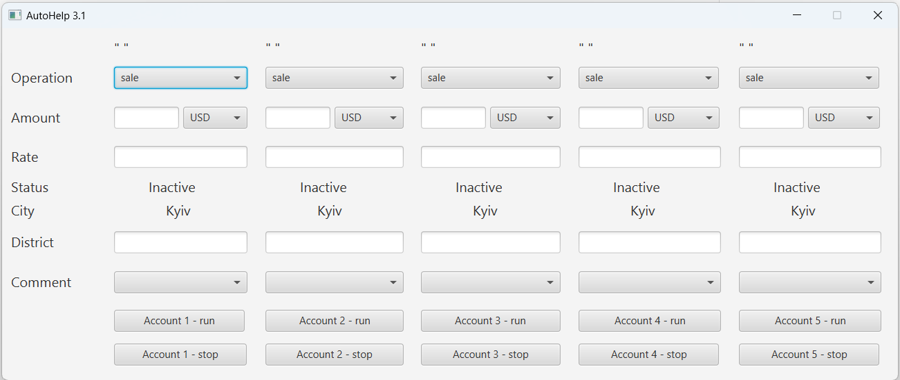

## AutoApplier JavaFx application
It was created for solving problem of adding a lot of the same applications
to a one of Ukrainian currency sales site:
 - you can just add your account credential and some values and your applicant automatically have to be created and updated every 60 seconds

It's based on JavaFX UI interface and Selenium executor: 
Each account represent original user account and can apply for the 5 different user accounts 

### Build
requirements: 
 - maven
 - java build with javaFx packages (example: `zulu17.36.15-ca-fx-jdk17.0.4`)

`mvn clean install`

#### The program works with Selenium driver and Chrome browser v88
